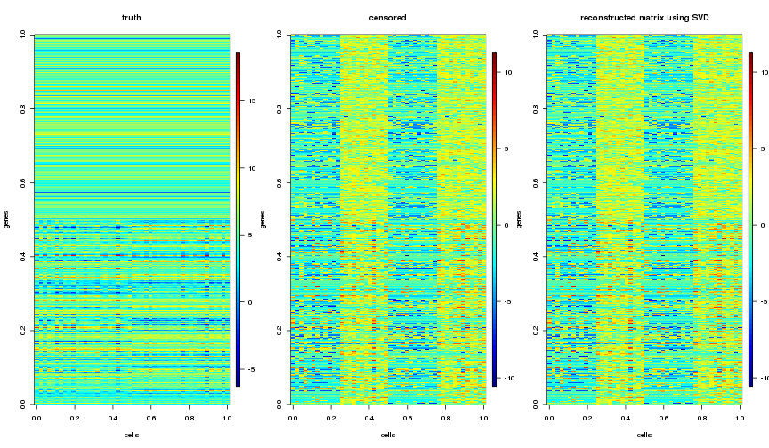

```r
---
title: "Explore Robust PCA"
author: "Stephanie Hicks"
output: html_document
---
```

```
## Error: <text>:7:0: unexpected end of input
## 5: ---
## 6: 
##   ^
```


# Robust PCA

- **Goal**: recover a low-rank matrix $L$ from highly “corrupted” measurements $M$ (where $M = L + S$) and L is the low-rank component and S is a sparse component with arbitrarily large magnitude of corruption (or errors). 
    - Here the low rank or sparse components could be the object of interest. 
    - vs Classic PCA: M = L + N where N is small noise. Here, we minimize the reconstruction error: $||M - L||$
- **How to solve**: 
    - Minimize $||L||_* + \lambda ||S||_1$ subject to $M = L + S$
    - where $||L||_*$ is the nuclear norm (i.e. sum of singular values of $L$) and $||S||_1$ is the L1 norm
    - Use **Principal Component Pursuit (PCP)** to solve minimization. 
    - Assumptions of PCP: 
        - $L$ is not sparse (use the incoherence condition = imposes a constraint on the singular vectors of $L$ to make them not sparse). 
        - Sparsity pattern is uniformly at random and $S$ cannot be low-rank. 

# Applications for Robust PCA

* [Liu et al. (2013)](https://www.ncbi.nlm.nih.gov/pmc/articles/PMC3654929/): Used Robust PCA to discover differentially expressed (S) and non-differentially expressed genes (L) from a gene expression matrix (M). Positive and negative values in S represented down- and up-regulated genes, respectively. Evaluated discovered differential expressed genes using Gene Ontology. 


# Available R packages for Robust PCA

* [rpca R package](https://cran.r-project.org/web/packages/rpca/index.html) 
  * The `rpca::rpca()` function decomposes a rectangular matrix M into a low-rank component, and a sparse component, by solving a convex program called *Principal Component Pursuit*. 
* [pcaPP R package](https://cran.r-project.org/web/packages/pcaPP/index.html)


# Try out `rpca` R package


Load libraries

```r
# library(devtools)
# install_github("willtownes/patel2014gliohuman")
library(patel2014gliohuman) 
library(SummarizedExperiment)
library(rpca)
library(ggplot2)
library(fields)
library(cowplot)
```


## Simulated data


```r
N = 48 # number of cells
G = 500 # number of genes 
L = 2 # dimension of latent subspace
Gsignal <- G/2 # number of rows that have signal out of G rows (rest are noise)

batch_labs<-data.frame(tumor=factor(rep(c("1","2"),each=N/2)),
                       plate=factor(rep(rep(c("A","B"),each=N/4),2)))
sigma <- matrix(c(1,0,0,1),nrow=2)
mu <- list(c(1,1),c(-1, -1))
dat <- do.call("rbind",lapply(1:2,function(x){genCluster(N/2,x,mu[[x]],sigma)})) # true latent structure
colnames(dat)[1:2]<-paste0("dim",1:2)

ref <- data.frame(dat[,1:2],batch_labs)

p <- simulate_data(L=L, G=G, N=N, Gsignal=Gsignal, 
                       U=t(as.matrix(ref[,1:2])), y0=5)
# p <- simulate_data(L=L, G=G, N=N, Gsignal=Gsignal, U=NULL)

#apply censoring MNAR
cens_rates<-rep(NA,N)
cens=c(.90,.05)
cens_rates[batch_labs$plate=="A"]<-rbeta2(sum(batch_labs$plate=="A"),cens[1],phi=200)
cens_rates[batch_labs$plate=="B"]<-rbeta2(sum(batch_labs$plate=="B"),cens[2],phi=200)

p$Y_obs <- censor_dat_mnar1(p, cens_rates, mcar=0.1, capture_eff=1, sigma_y=1)

Y_obs.cent <- sweep(p$Y_obs, 1, rowMeans(p$Y_obs), FUN = "-")
```

#### Classic PCA


```r
sv <- svd(Y_obs.cent)

par(mfrow=c(1,3))
image.plot(t(p$Y), main = "truth", xlab = "cells", ylab = "genes")
image.plot(t(Y_obs.cent), main = "censored", xlab = "cells", ylab = "genes")
# out <- sv$u[,1:2] %*% diag(sv$d[1:2]) %*% t(sv$v[,1:2])
out <- sv$u %*% diag(sv$d) %*% t(sv$v)
image.plot(t(out), main = "reconstructed matrix using SVD", xlab = "cells", ylab = "genes")
```



```r
par(mfrow=c(1,3))
image.plot(t(sv$u), main = "u", ylab = "genes")
image.plot(diag(sv$d), main = "d")
image.plot(sv$v, main = "v", xlab = "cells")
```


```r
# plot cells along first two PCs
scores.pca <- data.frame(ref, sv$v[, 1:4])
scores.pca$CDR <- colMeans(as.matrix(p$Y_obs) == 0)

p0 <-  ggplot(scores.pca, aes(x = dim1, y = dim2, color = tumor, shape = plate)) + 
    geom_point() + xlab("True Dim 1") + ylab("True Dim 2")
p1 <- ggplot(scores.pca, aes(x = X1, y = X2, color = tumor, shape = plate)) + 
    geom_point() + xlab("PC1") + ylab("PC2")

p2 <- ggplot(scores.pca, aes(x = CDR, y = X1, color = tumor, shape = plate)) + 
    geom_point() + xlab("detection rate") + ylab("PC1")

plot_grid(p0, p1, p2, ncol = 3)
```


#### Robust PCA using `rpca` R package

```r
res <- rpca(t(Y_obs.cent)) 
```

```
## Warning in rpca(t(Y_obs.cent)): rpca did not converge after 5001
## iterations, final.delta= 4.6550840383851e-07
```

```r
length(res$L.svd$d) # rank of low-rank component
```

```
## [1] 20
```


```r
par(mfrow=c(1,4))
image.plot(t(p$Y), main = "truth", xlab = "cells", ylab = "genes")
# image.plot(t(sweep(p$Y, 1, rowMeans(p$Y), FUN = "-")), main = "truth (centered)", 
#            xlab = "cells", ylab = "genes")
image.plot(t(Y_obs.cent), main = "censored", xlab = "cells", ylab = "genes")
image.plot(res$L.svd$L, main = "low-rank component (L)", xlab = "cells", ylab = "genes")
image.plot(res$S, main = "sparse component (S)", xlab = "cells", ylab = "genes")
```


```r
# Plot images of $u$, $d$ and $v$ from $L$.
par(mfrow=c(1,3))
image.plot(res$L.svd$vt, main = "u", xlab = "rank k", ylab = "genes")
image.plot(diag(res$L.svd$d), main = "d")
image.plot(res$L.svd$u, main = "v", xlab = "cells", ylab = "rank k")
```


```r
# plot cells along first two low-rank components (L)
scores.rpca <- data.frame(ref, res$L.svd$u[, 1:4])
scores.rpca$CDR <- colMeans(as.matrix(p$Y_obs) == 0)

p0.rpca <-  ggplot(scores.rpca, aes(x = dim1, y = dim2, color = tumor, shape = plate)) + 
  geom_point() + xlab("True Dim 1") + ylab("True Dim 2")

p1.rpca <- ggplot(scores.rpca, aes(x = X1, y = X2, color = tumor, shape = plate)) + 
  geom_point() + xlab("RPC1") + ylab("RPC2")

p2.rpca <- ggplot(scores.rpca, aes(x = CDR, y = X1, color = tumor, shape = plate)) + 
  geom_point() + xlab("detection rate") + ylab("RPC1")

plot_grid(p0.rpca, p1.rpca, p2.rpca, ncol = 3)
```


## Patel 2014 data

Here we use Patel et al. (2014) data. Only pick cells from one tumor that were processed in two batches. 


```r
#### Load Patel et al. (2014) counts and phenotypic data
data(patel_counts) # SummarizedExperiment
dim(patel_counts)
```

```
## [1] 36579   875
```

```r
counts <- as.matrix(assay(patel_counts))
pd = colData(patel_counts)
pd$CDR <- colMeans(counts != 0)

# filter for only single cells used in original analysis
counts <- counts[, pd$sampleType == "SC" & pd$includeSample == TRUE & pd$cellType == "Glioblastoma" & pd$tumorName == "MGH26"]
pd <- pd[pd$sampleType == "SC" & pd$includeSample == TRUE & pd$cellType == "Glioblastoma" & pd$tumorName == "MGH26", ]

# normalize for library size
cpm <- sweep(counts, 2, colSums(counts)/1e6, FUN = "/")

# log transform and center each gene
M <- log2(cpm + 1)
Mcent <- sweep(M,1,rowMeans(M), FUN = "-")
```

#### Classic PCA

```r
sv  <- svd(Mcent[1:1000,])
```

Plot images of $M$, and reconstructed matrix. Note: only showing first 1000 genes here.

```r
par(mfrow=c(1,2))
image.plot(t(Mcent[1:1000,]), main = "M", xlab = "cells", ylab = "genes")
out <- sv$u %*% diag(sv$d) %*% t(sv$v)
image.plot(t(out), main = "reconstructed matrix using SVD", xlab = "cells", ylab = "genes")
```


```r
par(mfrow=c(1,3))
image.plot(t(sv$u), main = "u", ylab = "genes")
image.plot(diag(sv$d), main = "d")
image.plot(sv$v, main = "v", xlab = "cells")
```


```r
scores <- data.frame(pd, sv$v[, 1:2])
p1.pca.patel <- ggplot(scores, aes(x = X1, y = X2, color = instrument)) + 
  geom_point() + xlab("PC1") + ylab("PC2")

p2.pca.patel <- ggplot(scores, aes(x = CDR, y = X1, color = instrument)) + 
  geom_point() + xlab("detection rate") + ylab("PC1")

plot_grid(p1.pca.patel, p2.pca.patel)
```


#### Robust PCA using `rpca` R package

For speed, I only pick first 1000 genes. Look at both the low-rank component (L) and sparse component (S). 


```r
res <- rpca(t(Mcent[1:1000,])) # only pick first 1000 genes
```

```
## Warning in rpca(t(Mcent[1:1000, ])): rpca did not converge after 5001
## iterations, final.delta= 7.2124437966205e-07
```


```r
# low-rank component 
str(res$L.svd)
```

```
## List of 4
##  $ d : num [1:15] 316.69 117.23 62.75 7.93 5.43 ...
##  $ u : num [1:118, 1:15] -0.103 -0.104 -0.117 -0.112 -0.113 ...
##  $ vt: num [1:15, 1:1000] 0.00186 0.0656 -0.09222 0.00771 0.00732 ...
##  $ L : num [1:118, 1:1000] -0.609 -1.252 -0.564 -0.143 -0.952 ...
```

```r
length(res$L.svd$d) # rank of low-rank component
```

```
## [1] 15
```

```r
# plot cells along first two low-rank components (L)
scores.rpca <- data.frame(pd, res$L.svd$u[, 1:4])

p1.rpca.patel <- ggplot(scores.rpca, aes(x = X1, y = X2, color = instrument)) + 
  geom_point() + xlab("RPC1") + ylab("RPC2")

p2.rpca.patel <- ggplot(scores.rpca, aes(x = CDR, y = X1, color = instrument)) + 
  geom_point() + xlab("detection rate") + ylab("RPC1")

plot_grid(p1.rpca.patel, p2.rpca.patel)
```


```r
# sparse component
dim(res$S)
```

```
## [1]  118 1000
```

Plot images of $M$, $L$ and $S$ (note: $M = L + S$). Note: only showing first 1000 genes here.

```r
par(mfrow=c(1,3))
image.plot(t(Mcent[1:1000,]), main = "M", xlab = "cells", ylab = "genes")
image.plot(res$L.svd$L, main = "low-rank component (L)", xlab = "cells", ylab = "genes")
image.plot(res$S, main = "sparse component (S)", xlab = "cells", ylab = "genes")
```


Plot images of $u$, $d$ and $v$ from $L$.

```r
par(mfrow=c(1,3))
image.plot(res$L.svd$vt, main = "u", xlab = "rank k", ylab = "genes")
image.plot(diag(res$L.svd$d), main = "d")
image.plot(res$L.svd$u, main = "v", xlab = "cells", ylab = "rank k")
```


```

